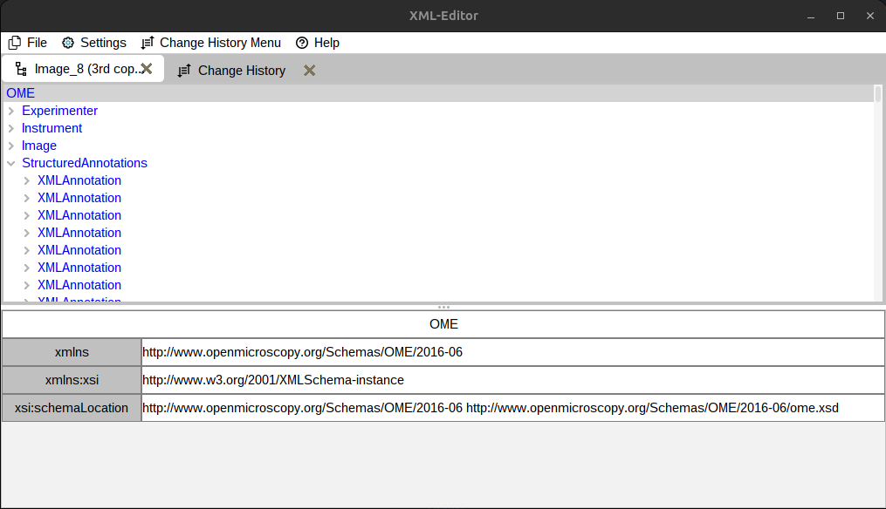
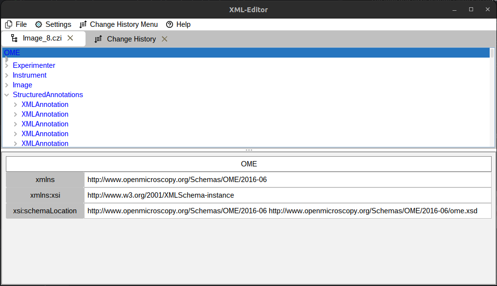
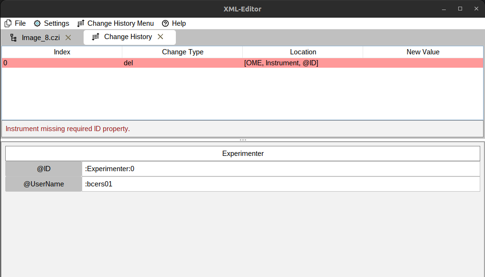
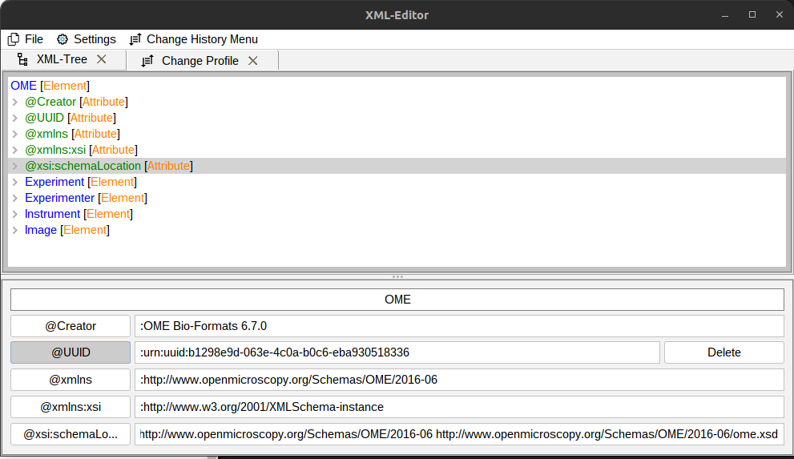
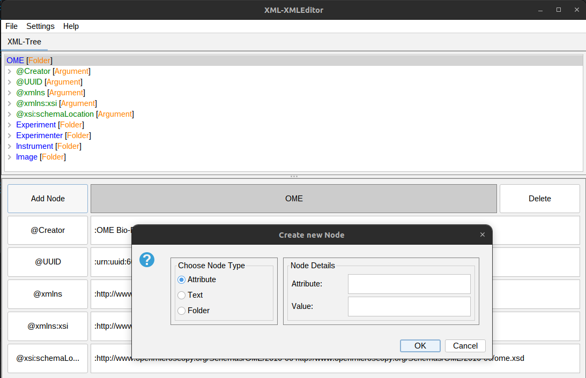
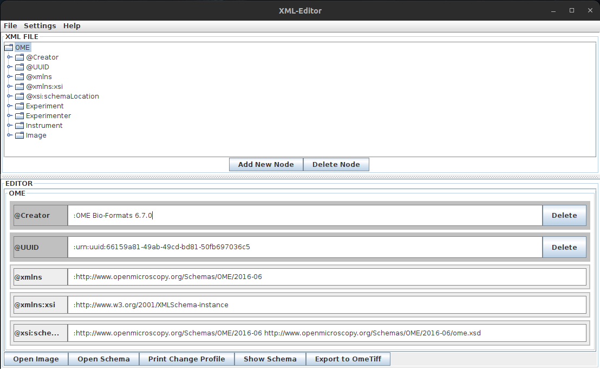

# XML metadata editor

---

Fiji plugin, that allows the user to EDIT (not add tags) the metadata of ome-xml files. This is usefull for example for curating metadata that was auto generated
by bioformats, but has flaws. Work in progress.

### Update 07.05.23

- fixed a visual bug, that occured when the application was started from within fiji
- reworked the simplified tree view system

### Update 20.04.23

**This patch manly contains changes to the back end**

- The load and save change History is reworked to now save the changes as serialized objects
- The way nodes have their type tagged is changed. Now the type is stored in the node itself,
instead of the node value. The different values wont start with ":, @, ..." anymore. This also
required to modify how changes are applied internally.
- Element nodes can now be double-clicked to be modified.

### Update 05.04.23

- Change History now shows what's wrong if the verification fails
- Simplified Tree view possible (that doesn't show attribute nodes etc.)
- Change history can be applied to a folder
- Added an undo button, to revert changes
- Tab now shows the name of the file

### Update 09.03.23

- Enabled Fiji support (again)
- Change profile tab now automatically updates when a new change happens
- The change history now automatically validates any change made and shows the result in the change history by changing the background color of the change
- Added some basic functions for loading a schema and showing some element of it

### Update 03.03.23

- Improved the Ui
- Added the ability to view and validate the change history
- added the ability to load and export the change history

### Update 25.02.23

- Improved the interaction when creating new nodes
- "Syntax" highlighting of the xml
- Cleaned up the GUI
- Fixed maven dependencies, so that the plugin can be build and used from within fiji
- The xml is now inside a tabbed pane

### Update 16.02.23

- Improved the change history function
- Added the ability to add new nodes (there are still some bugs)
- Improved look and user experience of GUI

### Update 14.02.23:

- Added Basic functionality such as:
  - Reading any image inclusive its metadata
  - Editing the values of argument and text nodes in its xml
  - Exporting the pixel- and meta- data as .ome.tif
  - A GUI that implements the said functionality

