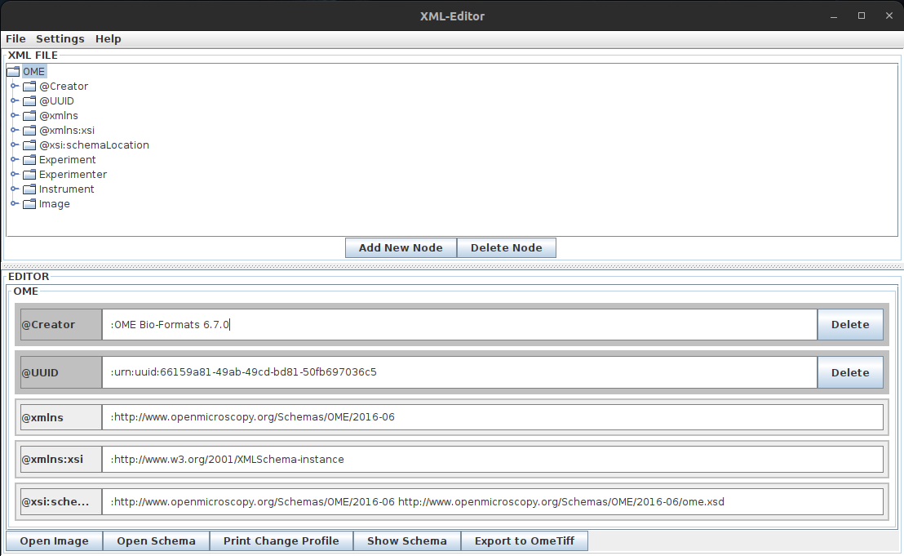

# XML_metadata_editor

Fiji plugin, that allows the user to EDIT (not add tags) the metadata of ome-xml files. This is usefull for example for curating metadata that was auto generated
by bioformats, but has flaws. Work in progress.

### Update 14.02.23:

- Added Basic functionality such as:
  - Reading any image inclusive its metadata
  - Editing the values of argument and text nodes in its xml
  - Exporting the pixel- and meta- data as .ome.tif
  - A GUI that implements the said functionality
