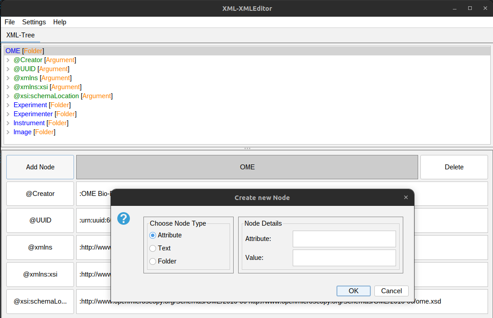
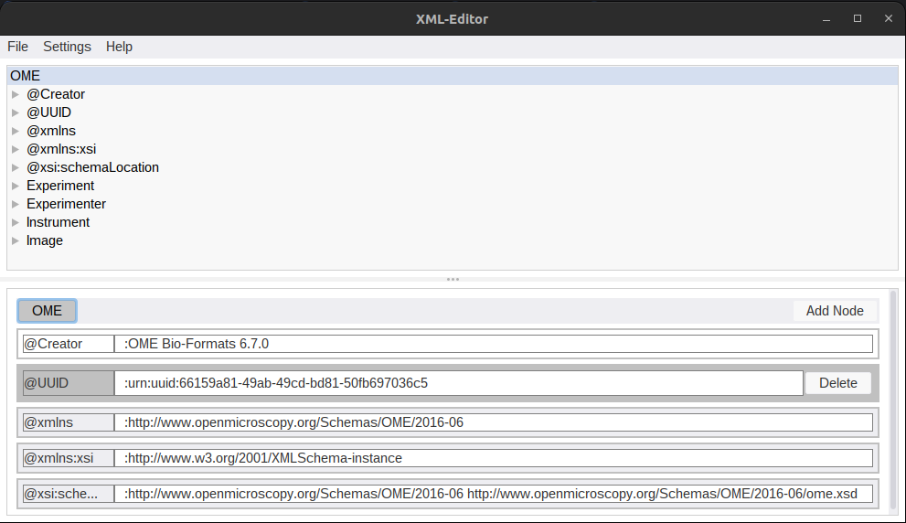

# XML_metadata_editor

Fiji plugin, that allows the user to EDIT (not add tags) the metadata of ome-xml files. This is usefull for example for curating metadata that was auto generated
by bioformats, but has flaws. Work in progress.

### Update 25.02.23

- Improved the interaction when creating new nodes
- "Syntax" highlighting of the xml
- Cleaned up the GUI
- Fixed maven dependencies, so that the plugin can be build and used from within fiji

### Update 16.02.23

- Improved the change history function
- Added the ability to add new nodes (there are still some bugs)
- Improved look and user experience of GUI

### Update 14.02.23:

- Added Basic functionality such as:
  - Reading any image inclusive its metadata
  - Editing the values of argument and text nodes in its xml
  - Exporting the pixel- and meta- data as .ome.tif
  - A GUI that implements the said functionality

