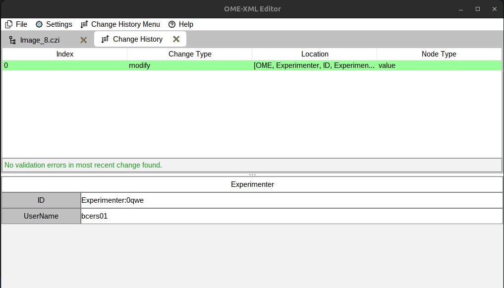
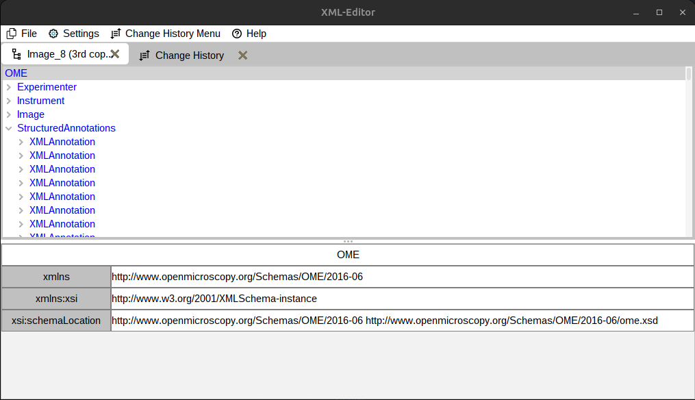
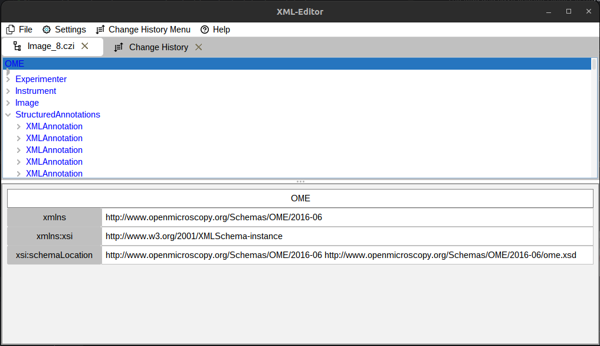
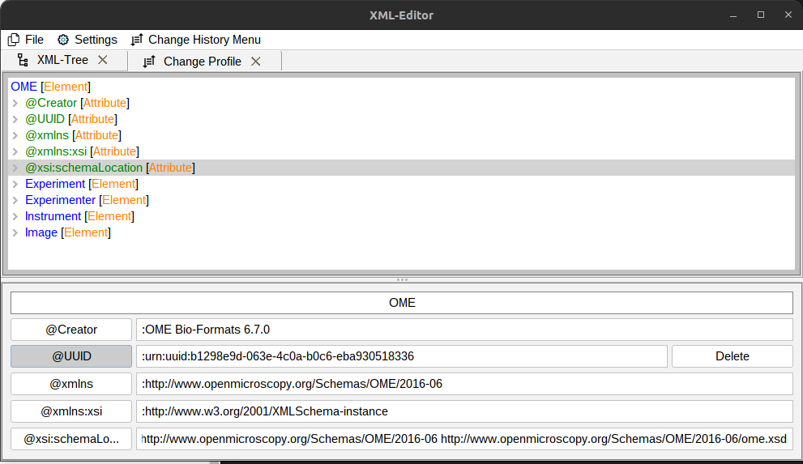
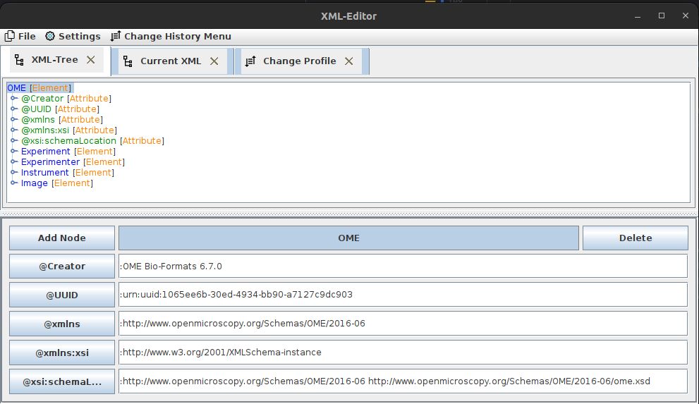
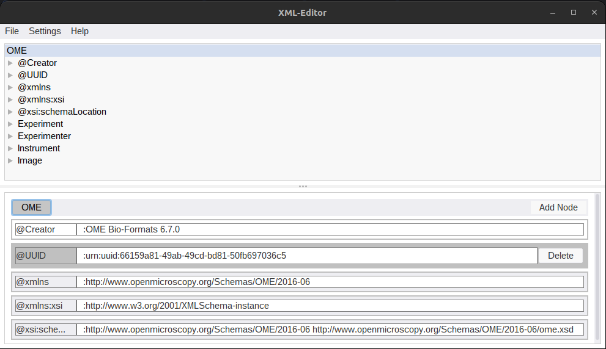

# OME-XML Metadata Editor

A Fiji plugin, that allows the user to **edit** (not add tags) the metadata of ome-xml files. This is useful for example for
curating metadata that was auto generated by bioformats, but has flaws. Work in progress.

## Overview

- [Overview](#overview)
- [Installation](#installation)
- [How to use the XML-Editor](#how-to-use-the-xml-editor)
- [Update History](#Update-History)

## Installation

Simply place the .jar file in the plugins folder of your Fiji installation. **Additionally you need to set a schema to
validate against**, this is most likely the latest ome schema available [here](http://www.openmicroscopy.org/Schemas/OME/2016-06/ome.xsd).
Set the path to the location in the settings of the plugin.

## How to use the OME-Editor

1. Select a file (an image of your choice) by clicking on file and then open image
2. Select a node by clicking on it in the tree in the upper part of the window
3. Edit the node by changing nodes in the lower part of the window.
4. To change the value of an attribute, simply change its text.
5. To delete nodes, click on them (in the lower window) and press the delete button that popped up.
6. To add Nodes, click on the title, an add button should pop up.
7. View the change you have made by clicking on Change History and then on show change history.
8. To save the file as .ome.tiff with the changes applied, click on file and then export to ome.tiff.
9. To save the change history, click on change History and then save change history.

## Update History

### Update 23.08.23

- noticeably sped up the export process (x12 for me) by using another writer
- changed the validation method used
- added a popup to warn the user to set a schema path if none is set
- added a menu item to set the schema path

### Update 12.07.23

- changed the name to OME-XML-Editor
- change history is now opened by default
- the currently edited attribute or text is highlighted while editing
- leaving a text field or attribute field reverts the changes unless enter was pressed
- a change is no longer submitted to the change history if it was empty

### Update 07.05.23

- fixed a visual bug, that occured when the application was started from within fiji
- reworked the simplified tree view system

### Update 20.04.23

**This patch manly contains changes to the back end**

- The load and save change History is reworked to now save the changes as serialized objects
- The way nodes have their type tagged is changed. Now the type is stored in the node itself,
instead of the node value. The different values wont start with ":, @, ..." anymore. This also
required to modify how changes are applied internally.
- Element nodes can now be double-clicked to be modified.

### Update 05.04.23

- Change History now shows what's wrong if the verification fails
- Simplified Tree view possible (that doesn't show attribute nodes etc.)
- Change history can be applied to a folder
- Added an undo button, to revert changes
- Tab now shows the name of the file

### Update 09.03.23

- Enabled Fiji support (again)
- Change profile tab now automatically updates when a new change happens
- The change history now automatically validates any change made and shows the result in the change history by changing the background color of the change
- Added some basic functions for loading a schema and showing some element of it

### Update 03.03.23

- Improved the Ui
- Added the ability to view and validate the change history
- added the ability to load and export the change history

### Update 25.02.23

- Improved the interaction when creating new nodes
- "Syntax" highlighting of the xml
- Cleaned up the GUI
- Fixed maven dependencies, so that the plugin can be build and used from within fiji
- The xml is now inside a tabbed pane

### Update 16.02.23

- Improved the change history function
- Added the ability to add new nodes (there are still some bugs)
- Improved look and user experience of GUI

### Update 14.02.23:

- Added Basic functionality such as:
  - Reading any image inclusive its metadata
  - Editing the values of argument and text nodes in its xml
  - Exporting the pixel- and meta- data as .ome.tif
  - A GUI that implements the said functionality

